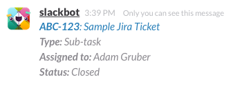

#slack-slash-jira

Command handler for [slack-slash][ss] that makes it easy to get quick info on a Jira ticket right from Slack.

##Usage

Once installed and configured you can type `/jira [ticket]` into Slack and it will respond like this:



##Installation

1. Configure slash-command integration in Slack. [More info](https://api.slack.com/slash-commands)
2. Clone and install [slack-slash][ss]
3. Run `npm install slack-slash-jira --save` inside your [slack-slash][ss] directory
4. Configure handler in `handlers.json`
5. Set the environment variable for your Slack token

##Configuration

In order to use slack-slash-jira as part of [slack-slash][ss], you need to add an entry for it inside `handlers.json`.

####Config Object Properties

```
command:  @{String} slash command typed into slack, ie. ('/jira')
pkg:      @{String} module name to require
tokenVar: @{String} environment variable where slack token for slash command is stored
options:  @(Object) options to pass to the handler
```

**Example**
```js
// handlers.json
[
  {
    "command": "jira"
    "pkg": "slack-slash-jira",
    "tokenVar": "slack_slash_jira_token",
    "options": {...}
  }
]
```

####Options Object Properties

slack-slash-jira requires the following options:

```
jira:             @{Object} jira options and authentication
jiraIssueRegEx:   @{String} regex to use for matching ticket numbers
                            must be escaped to work properly
jiraIssueBaseUrl: @{String} base url for accessing your jira tickets
```

**Example**
```js
"jira": {
  "protocol": "https",
  "host": "jira.company.net",
  "port": 123,
  "user": "jirauser",
  "password": "password",
  "apiVersion": "2",
  "verbose": true,
  "strictSSL": false
},
"jiraIssueRegEx": "/(^[a-z]+)(-?)(\\d+$)/i",
"jiraIssueBaseUrl": "https://jira.company.net/browse/"
```

## License

[MIT](/LICENSE.md)

[ss]: https://github.com/dowjones/slack-slash
